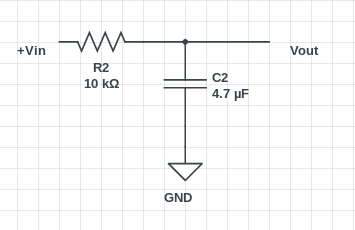

## API Hardware Echo Tests

### Echo device

Echo device is just an Arduino Board (ATmega328P) which responds on specific actions. The code that needs to be uploaded to arduino board is located in tests/arduino/echo_service.ino

### Testing

Are loaced in normal test folders, just run normal test suite while the echo service is connected.

#### Implemented tests (artik53 only)

#### GPIO

To setup please connect:
* Arduino IOref and Vin pins with test device Vout pins
* Arduino pin 7 to pin 7 on test device (gpio48)
* Arduino pin 8 to pin 8 on test device (gpio50)
* Arduino GND with test device GND

With this setup Arduino board is powered by test service so no signal converers/transistors/resistors are needed

`test/run_pass/test_gpio_echo.js`

This is the test file which checks starting state input pin, puts a HIGH signal on output pin and tests input pin again which should be set to HIGH by echo service (Arduino)

#### I2C

TODO

#### SPI

To setup please connect
* Ardino 13 SCK Pin to test devce SPI Clock pin
* Arduno 12 MISO Pin to test device SPI MISO pin
* Arduno 11 MOSI Pin to test device SPI MOSI pin
* Arduno 10 Chip Select Pin to test device SPI Chip Select

To run the test please run

`test/run_pass/test_spi_echo.js`

#### UART

TODO

#### ADC

TODO

#### PWM

To setup please connect
* Arduino A0 ADC pin low-pass filter Vout
* Arduino AREF pin to device GND
* Artik 053 pin 7 on CON703 to low-pass filter Vin
* Artik 053 GND pin to low-pass filter GND
* Arduino 4 pin to Artik 053 pin 13 on CON703
* Arduino 3 pin to Artik 053 pin 15 on CON703
* Arduino 2 pin to Artik 053 pin 17 on CON703

To run the test please run

`test/run_pass/test_pwm_echo.js`

The test starts with PWM half duty cycle to generate half of max voltage (1.6V), if Arduino reads that it responds with request for full voltage (3.3V) if that is ok then Arduino responds that test is passed.

Low-Pass filter schematic

